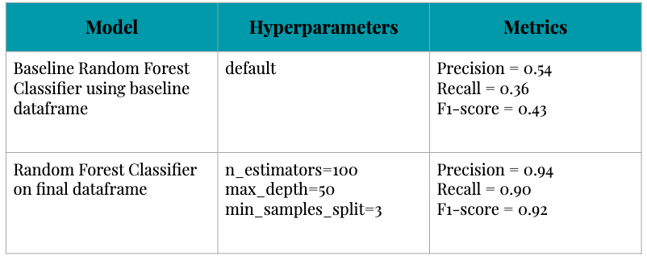

# Detecting event invitation fraud using random forest

#### Link to final product: http://fraud-detection-galvanize.s3-website-us-east-1.amazonaws.com/

<b>Motivation</b>
		Of the numerous digital threats to companies, one of the most difficult threat to diagnose and eradicate is fraud. Fraudulent activity is a high-cost threat that can compromise the integrity of any digital firm who seeks to build credibility while maximizing profit. The company being examined in this project is an online promoter of events such as concerts, parties, and shows. The objective is to detect fraud while minimizing classifying legitimate events as fraud.

<b>Business Challenges</b>
		Fraud accounts for less than 3% of all transactions making detection challenging. Over-predicting fraud would lead to excessive expenses due to the quantity of cases the firm would need to manually research. Allowing fraud into the system leads to a lack of trust and credibility. The team   costs due to 

<b>Pipeline and Feature Engineering</b>
	•	Focused on the fact if the column is filled or not. (Boolean notation)
	•	Focused on quantity. (Number of tickets sold, total quantity they are selling and payouts made previously)
	•	Dropped columns to keep each column independent properties. 
	•	Used the facts which country code and e-mail domain are used by fraud.


<b>Model Selection and Performance</b>

<b>Real Time Fraud Detection Dashboard</b>
		Designed to asses quantities and cost of fraud. Additionally, the dashboard contains features which allow the end users to reassign the thresholds used to generate fraud alerts to internal teams. This will allow the firm to maximize the quality of the service while minimizing costs.

http://fraud-detection-galvanize.s3-website-us-east-1.amazonaws.com/
